# 2026년 제8회 K-디지털 트레이닝 해커톤 — 예선 심사과제(아이디어 개발 기획서) · 팀 AXIs

> **지위: 상위 계약(시연 계약).** 예선 제출본(2026-08-10 제출, PDF 10p)을 원문 그대로 md로 이식한 문서. 본문 서술은 제출 당시 원문이며 **수정 금지** — 이후 설계 변경은 `skeleton-v3.md` §8 M-xx 대장에 기록되고, 이 문서와 어긋나는 항목은 M-xx가 우선하는 것이 아니라 **M-xx에 "예선 문서 대비 변경 사유"가 적혀 있어야 한다**.
> 이식 메모(본문 아님): ① 첨부 9 그림의 "Airflow"는 M-16으로 Dagster 확정(발표에서 한 줄 선제 처리) ② 첨부 이미지는 `assets/prelim/`에 원본 추출 보존 ③ 원본 PDF는 이 md로 대체·삭제(2026-08-25).

| 항목 | 내용 |
|---|---|
| 참가팀명 | AXIs |
| 참가과제 | **지정과제** — AI 전환 시대, 인간의 역량을 확장하는 디지털 서비스 개발 |
| 아이디어 명칭 | 온프레미스 LLM·RAG를 활용해 외국인 근로자가 모국어로 일을 배우고 이해를 증명하는 소규모 제조 사업장 다국어 소통 및 지식 플랫폼 |
| 관련분야 | 인공지능, 클라우드, 빅데이터, 사이버보안 |

---

## 1. 추진 배경

> 누구나 동등한 환경에서 일할 권리가 있다. 외국인 근로자에게 필요한 것은 특별한 배려가 아니라, 자신이 이해하는 언어로 동등하게 일할 수 있는 환경이다.

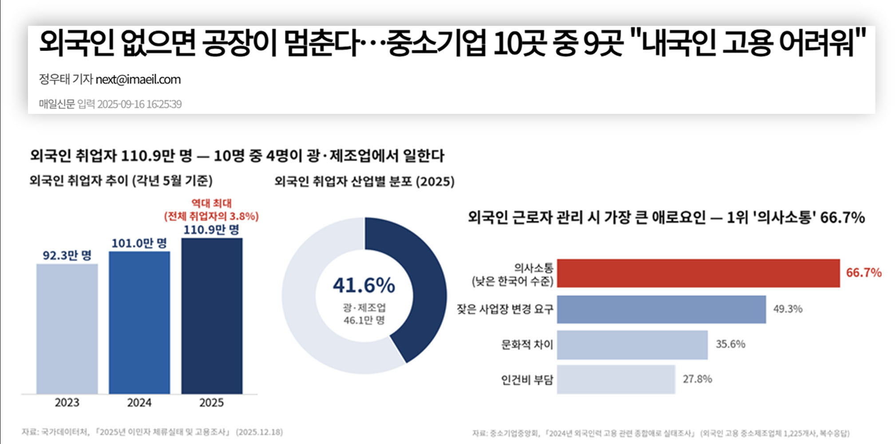
*첨부 1. 외국인 취업자 추이와 산업별 분포 · 첨부 2. 외국인력 관리 애로요인*

### 중소 제조업에 외국인 인력은 "선택"이 아니라 "전제 조건"이다
- 인력 부족 응답 업체 비중 상승(12.0%(2019) → 15.3%), 생산/현장직, 중소 제조업에 집중 — 한국은행 지역경제보고서, 2023.12
- 전국 228개 시군구 중 130곳(57%)이 소멸위험지역, 지방의 내국인 인력 구조가 무너짐 — 한국고용정보원, 2024
- 2025년 기준, 국내 외국인 취업자는 110.9만 명(전체의 3.8%)으로 역대 최대
- "외국인 근로자가 빠지면 공장 가동이 어렵다"는 현장의 증언 — 매일신문, 2025.9

### 언어의 벽이 역량의 벽이 되고 있다
- 중소 제조업체의 최대 관리 애로: '한국어 소통 문제'(66.7%) — 중소기업중앙회, 2024
- E-9 선발 시험(EPS-TOPIK)은 생활 한국어 수준 → 실무/작업 지시까지 담아내지 못함

### 소통 단절로 인한 생산성 하락, 조기 이탈, 그리고 안전 문제
- 2023년 산재 사고사망자 812명 중 85명(10.5%)이 외국인으로, 전체 취업자 중 외국인 비중(3.2%)의 3배 이상 — 고용노동부
- 사고사망의 78.4%가 50인 미만 사업장에서 발생 — 고용노동부
- 중대재해처벌법 확대 적용(2024.1)으로 소규모 사업장의 안전관리 책임은 더 커짐

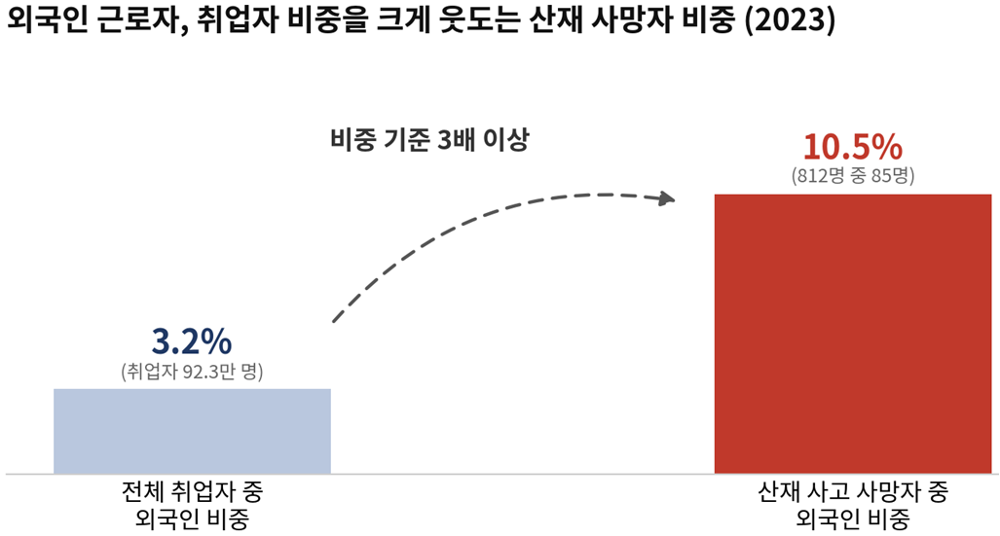
*첨부 3. 고용 비중 대비 산재 사망자 비중*

### 그런데 사업장은 "교육 공수"가 생기는 순간 도입을 포기한다
중소 제조업체의 최대 관리 애로는 의사소통(66.7%)이지만(중소기업중앙회, 2024), 채용 후 언어/안전/공정 교육에 드는 시간과 비용, 그리고 숙련 시점의 이탈로 인한 손실을 사업주가 다시 짊어져야 하는 구조다. 고용허가제 산업안전 특화훈련 참여율은 11.9%에 그친다. 집합교육과 단발성 통역은 이미 작동하지 않고 있다. 따라서 도입 조건은 명확하다.

> **관리자 추가 공수 0** — 기존 작업지시서/매뉴얼을 올리는 것만으로 서비스가 완결되어야 한다.

### 기존 접근은 왜 이 문제를 풀지 못했나
- 핵심 문제: 번역의 부재(X) | **정보·지식 접근의 불평등(O)**
> 기존 대안은 "전달했는가"까지만 해결할 뿐 "이해했는가"를 검증하지 못한다.

| 구분 | 범용 번역 앱 (파파고 등) | 대기업 자체 시스템 (롯데건설 등) | 안전교육 특화 서비스 | **AXIs 플랫폼 (MoGuk)** |
|---|:-:|:-:|:-:|:-:|
| 사업장 용어 보정 | X | △ (자사 용어만) | X | **O** |
| 이해 검증 (양방향) | X | X (일방향 전달) | △ (수료 확인만) | **O** |
| 50인 미만 도입 가능 | O | X (자사 현장 전용) | O | **O** |
| 내부 데이터 보호 (온프레미스) | X | O | X | **O** |
| 사용할수록 개선 (축적 루프) | X | X | X | **O** |

> 집합 안전교육과 단발성 통역은 결과를 사후 보완할 뿐 소통 자체를 풀지 못한다(고용허가제 산업안전 특화훈련 참여율 11.9%).
> 대기업의 AI 번역 시스템(롯데건설(20개 언어), 대우건설(최대 180개), GS건설, 호반건설 등)은 자사 현장 전용이라 중소 사업장은 사각지대이고, 일방향 전달에 머문다.

### 아이디어 개요 — 모국어로 배우고, 이해를 증명한다
언어에 묶여 있던 근로자의 역량을 모국어 학습과 이해 검증으로 확장하는 다국어 소통·지식 플랫폼을 설계했다. 50인 미만 중소 제조 사업장을 대상으로 구독형 SaaS(공공은 B2G 연계)로 제공하며, 사업장이 작업지시서와 매뉴얼을 등록하면 전용 지식베이스가 생성되고, 근로자는 QR 초대로 접속해 자기 언어로 배우고 질문하고 보고하며, 관리자 전용 대시보드에서 근로자별 이해도를 확인한다.

### 비즈니스 모델 — 사업장 단위 구독(B2B SaaS)과 공공 연계(B2G)
사업장 단위 월 구독제(외국인 근로자 수 구간별 정액)를 기본으로 하고, 고용허가제 취업교육(한국산업인력공단), 외국인노동자지원센터, 안전보건공단 다국어 교육과의 B2G 연계를 병행한다. 가격 구간은 사업주 지불 의향 설문(진행 중) 결과로 확정한다.

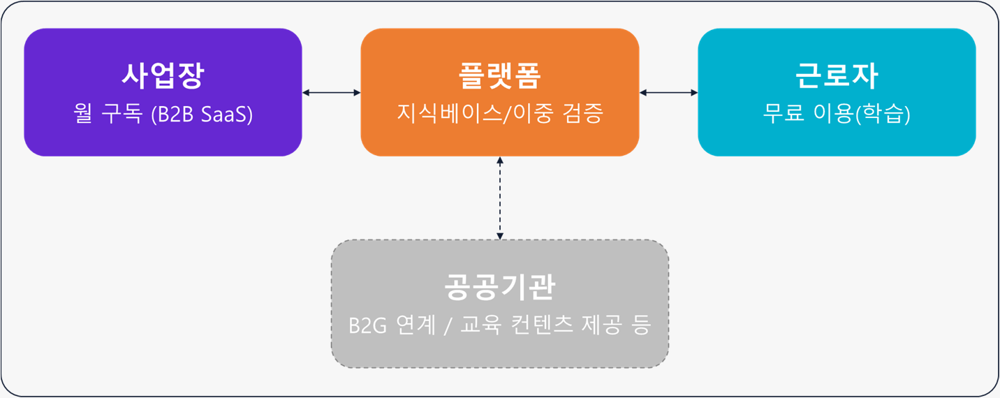
*첨부 4. 비즈니스 모델*

---

## 2. 개발 내용

**사업장 전용 지식베이스 위(작업지시서, 매뉴얼 등 업로드)에서, 근로자의 모국어 학습, 질의, 보고와 관리자의 이해도 확인이 한 흐름으로 동작하는 다국어 소통 및 지식 플랫폼의 MVP 구현**

### 구현 목표와 범위
대회 기간 내 **가상의 소규모 제조 사업장 1곳(CNC, 프레스 가공 등)** 을 대상으로 MVP를 완성한다. 지원 언어는 E-9 국적 상위 기준(법무부)에 따라 **베트남어, 인도네시아어 2종으로 한정**하고, 언어와 직종 확장은 이후 로드맵으로 명시한다.

### 정량 목표

| 지표 | 정의·측정 방법 | 목표 |
|---|---|---|
| 현장 용어 번역 정확도 | 가상 사업장 매뉴얼 기반 용어 포함 30문장 테스트셋, 범용 번역 대비 오역률 | 범용 대비 오역률 감소 확인 |
| 응답 근거 인용률 | 질의응답 중 사업장 자료 출처가 제시된 응답 비율 | **100%** (근거 없는 응답 차단) |
| 오류 검출률 | 백트랜슬레이션 게이트가 잔여 오역을 잡아내는 비율 | [측정 후 기입] |
| 이해 확인 완주율 | 학습→퀴즈→통과 플로우 완료 비율(시연 시나리오 기준) | 시연 시나리오 100% 동작 |
| 도입·사용 의향 | 사업주/근로자 설문(5점 척도, NPS형 추천 의향 포함) | [수집 중] 평균 4.0 이상 |

### 사용 흐름(Userflow) — 양측 공수 최소화

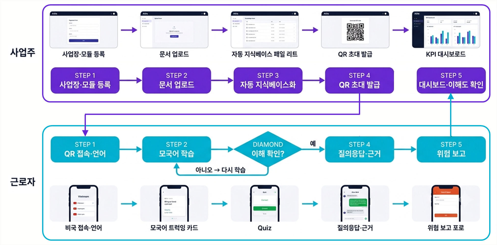
*첨부 5. MoGuk 유저 플로우(사업주/근로자)*

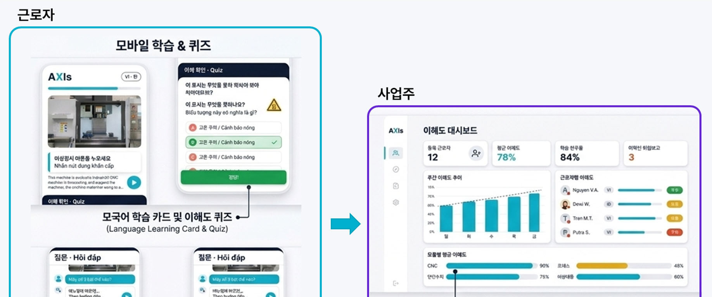
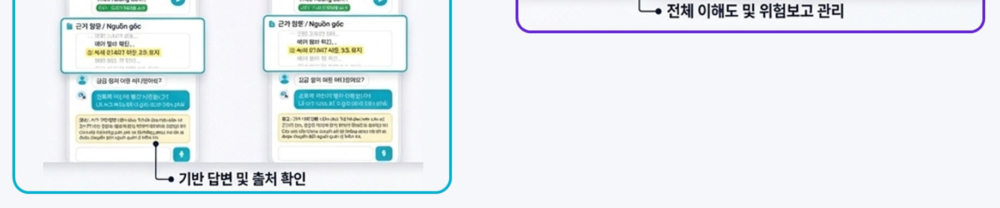
*첨부 6. MoGuk 근로자/사업주 실제 화면(목업)*

- **사업주**: 사업장 등록/모듈 선택 → 기존 문서 업로드 → 자동 지식베이스화 → 근로자 정보 등록 → 일회성 QR 초대 코드 발급 → 대시보드 확인, 용어 사전 승인/반려만 수행한다.
- **근로자**: QR 접속 → 국적/언어 선택 → 개인 시간에 스마트폰으로 작업 내용/현장 용어 및 안전 수칙을 학습 → 퀴즈 검증(질문 입력 시 사업장 자료에 근거한 답변 수신) → 위험/이상은 모국어로 보고, 관리자에게 한국어 요약 전달(상향 보고) → "멈춰 주세요" 같은 핵심 문장은 따라 말하기로 연습한다.

### 현장 제약 반영
- 작업 중 제한적인 휴대폰 사용
  > 학습은 사전에 각자의 공간에서 수행
  > 현장에서는 이미 학습한 내용을 즉시 참조/확인(관리자 기기 대면 통역과 설비 QR/NFC 태그 등)
- > 별도 단말/앱 또는 설치/전담 IT 인력 없이 SaaS로 시작 가능

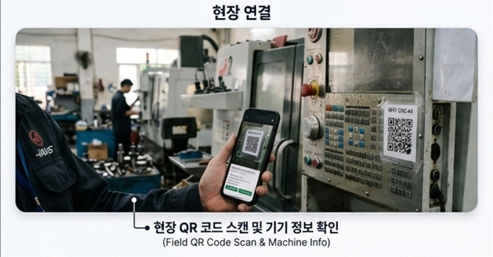
*현장 연결 — 현장 QR 코드 스캔 및 기기 정보 확인*

### 시스템 구성 및 데이터
구성은 **React, FastAPI, PostgreSQL(pgvector), Whisper(STT), LLM 어댑터(온프레미스 Ollama/외부 API), Docker(데모: AWS EC2, S3)**. 내부 데이터(도면, 공정, 작업지시, 인사)는 온프레미스 밖으로 나가지 않는다는 원칙 아래 데이터 등급별 LLM 라우팅을 두고, 배포는 SaaS/하이브리드/풀 온프레미스 중 선택하며, 사업장별 데이터는 완전 분리한다. 데이터는 전량 공개 자료와 자체 제작물(NCS 기계가공 학습모듈, KOSHA 16개국어 안전보건 자료, 고용노동부 EPS 다국어 가이드, 가상 장비 매뉴얼)이다.

---

## 3. 주요 특징 및 핵심 기술

**번역해 주는 앱이 아니라, 이해를 증명하는 플랫폼**
1. 현장 용어 보정 RAG와 이중 검증 — 가설·검증의 계단
2. 데이터 등급별 LLM 라우팅과 온프레미스 격리
3. 축적 루프 — 쓸수록 두꺼워지는 사업장 지식 자산

### 주요 특징
핵심은 두 가지다.
1. 소통 코어 위에 **실무 학습(퀴즈), 안전교육, 말하기 연습, 정착 지원 모듈**을 필요한 만큼 골라 얹는 **모듈형 구조**
2. "전달했다"를 넘어 "이해했다"까지 **데이터로 남기는 이중 검증** > 사후 확인 가능

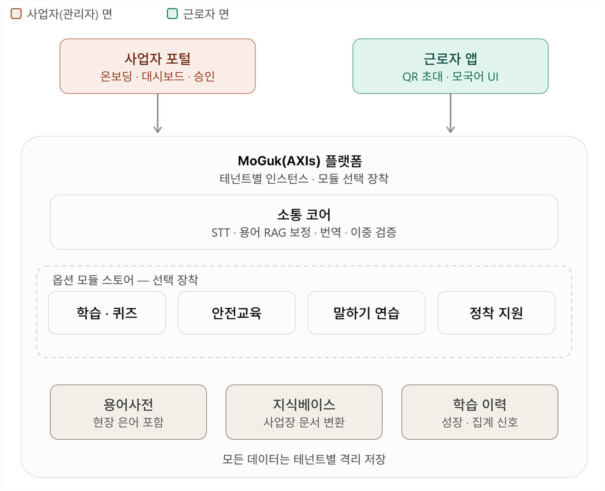
*첨부 7. MoGuk 핵심 구조*

### 핵심 기술 ① 현장 용어 보정 RAG와 이중 검증 — 가설/검증의 계단
본 팀의 기술적 주장은 **"범용 번역은 현장에서 실패하며, 사업장 용어 사전 기반 RAG 보정과 검증 게이트가 이를 정량적으로 개선한다"** 는 것이다. 이를 3단계 가설로 나누어 직접 측정한다.

| 단계 | 가설 | 측정 방법 |
|---|---|---|
| 1단 (Baseline) | 범용 번역은 현장 용어에서 체계적으로 실패한다 | 가상 사업장 매뉴얼 기반 용어 포함 30문장 테스트셋 제작, 파파고·구글 번역·범용 LLM 오역률 측정 |
| 2단 (RAG 보정) | 용어 사전 RAG 보정이 오역률을 유의하게 낮춘다 | 동일 테스트셋을 보정 파이프라인에 통과시켜 오역률 비교 |
| 3단 (검증 게이트) | 백트랜슬레이션 대조가 잔여 오류를 응답 전에 걸러낸다 | 보정 후에도 남은 오역에 대한 게이트 검출률 측정 |

질의는 **에이전틱 플로우(입력 분류 → 용어 보정·지식 검색·번역 병렬 → 형식/권한/근거 검증 후 응답)** 로 처리하며, 근거 없는 질문에는 답하지 않고 관리자 확인으로 넘긴다. 기계 검증(백트랜슬레이션)에 사람 검증(되말하기 대조)을 더해 이중 검증을 완성한다.

### 핵심 기술 ② 데이터 등급별 LLM 라우팅과 온프레미스 격리
중소 제조의 최대 도입 장벽은 내부 데이터(도면·공정·작업지시·인사) 유출 우려다. "내부 데이터는 온프레미스 밖으로 나가지 않는다"는 원칙 아래, **민감 데이터 처리와 PII 마스킹은 온프레미스 LLM(Ollama)이 전담하고 비민감 번역만 외부 API를 사용**한다. 배포는 SaaS/하이브리드/풀 온프레미스 중 선택하며 사업장별 데이터는 완전 분리한다. 데모 데이터는 전량 공개 자료와 자체 제작물(NCS 기계가공 학습모듈, KOSHA 16개국어 안전보건 자료, EPS 다국어 가이드, 가상 장비 매뉴얼)로 구성해 저작권·개인정보 리스크를 차단했다.

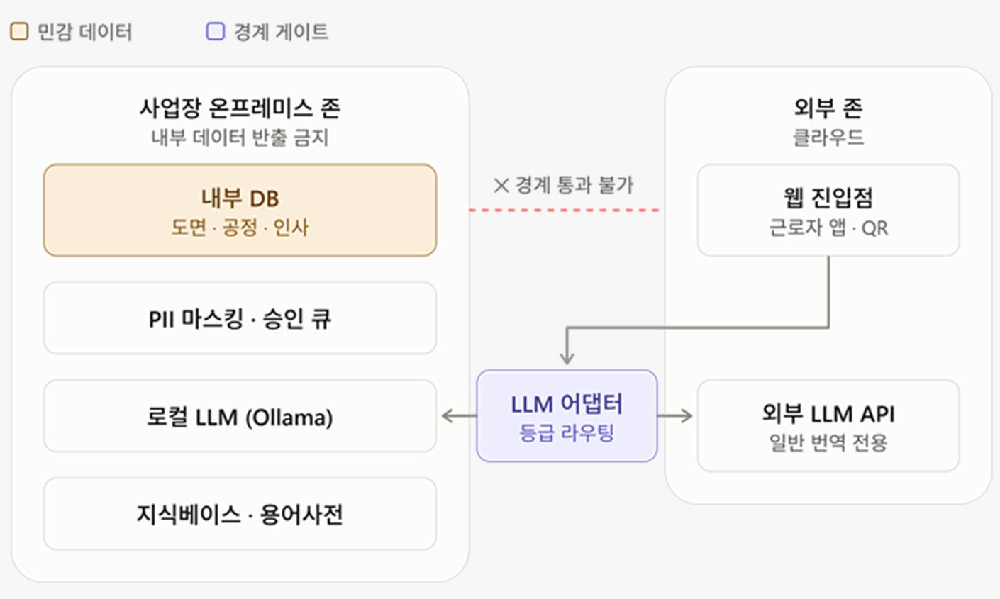
*첨부 8. 온프레미스 격리 구조*

### 핵심 기술 ③ 축적 루프 — 쓸수록 두꺼워지는 사업장 지식 자산
소통·질의 기록에서 추출된 용어 후보는 관리자 승인을 거쳐 용어 사전에 편입되고, 반복 질문은 학습 콘텐츠(퀴즈)로 재생산된다. 사용할수록 번역 품질과 학습 콘텐츠가 동시에 개선되는 구조로, 사업장별 암묵지가 검색 가능한 지식 자산으로 축적된다.

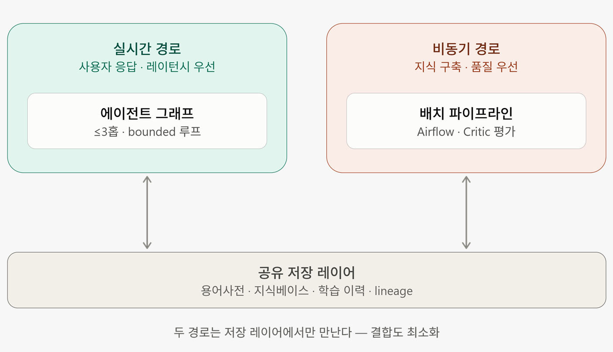
*첨부 9. 실시간/비동기 이원 처리 경로 — 실시간 경로(에이전트 그래프 ≤3홉·bounded 루프) / 비동기 경로(배치 파이프라인·Critic 평가) / 두 경로는 공유 저장 레이어(용어사전·지식베이스·학습 이력·lineage)에서만 만난다*

### 한계와 돌파 방안

| 한계 | 현재 대응 | 향후 계획(Further Work) |
|---|---|---|
| 저자원 언어 음성 인식 정확도 | 텍스트 입력 병행, 핵심 문장 따라 말하기로 발화 패턴 수집 | 현장 발화 데이터 축적 후 Whisper 파인튜닝 |
| 은어·신조어의 사전 커버리지 | 관리자 승인형 용어 후보 추출로 점진 확장 | 사업장 간 익명화된 산업 공통 용어망 구축 |
| 되말하기 검증의 현장 부담 | 고위험 지시에만 선별 적용, 나머지는 기계 검증 | 이해도 리스크 스코어 기반 자동 선별 |
| LLM 환각(hallucination) | 근거 인용 강제·무근거 응답 차단·처리 이력 기록 | 검증 게이트 다단화 및 정확도 정량 공개 |

### 보안/신뢰 설계 — 실수는 시스템이 막고, 서비스는 멈추지 않는다

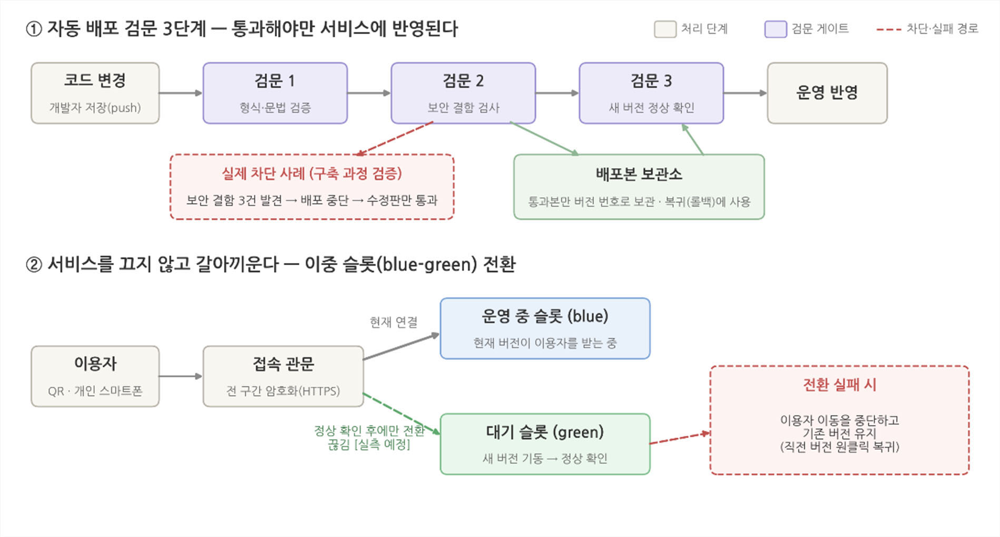
*첨부 10. 시스템 배포 및 운영 구조 — ① 자동 배포 검문 3단계(형식 → 보안 → 동작) ② blue-green 이중 슬롯 전환*

개인정보는 최소한만 수집(이름, 국적, 근무 내용 등)하고, 모든 처리 과정을 기록으로 남긴다. 코드 변경은 **3단계 자동 검문(형식 → 보안 → 동작)** 을 통과 후 반영 — 실제로 구축 중 보안 결함 3건을 배포 전에 차단했다. 새 버전은 서비스를 끄지 않고 교체하며(**blue-green**), 문제가 생기면 직전 버전으로 즉시 되돌린다. 외부 AI가 멈추면 사업장 내부 LLM으로 자동 전환되고, 데이터는 매일 백업해 실제 복원까지 검증한다. 비밀키는 보관하지 않으며(일회용 토큰), 접속 전 구간을 HTTPS로 암호화한다.

---

## 4. 기대효과 및 활용방안

### 정량 효과 ① 사업장 1곳 기준 연간 절감액(Bottom-up)
50인 미만 제조 사업장 1곳, 외국인 근로자 4명 고용을 가정한 보수적 추정이다. 산정 가정은 표에 명시하며, 계수는 현장 인터뷰 결과로 보정한다.

| 항목 | 산정 근거(가정) | 연간 추정 |
|---|---|---|
| 관리자 소통 및 재설명 공수 절감 | 관리자 1인 일 30분 소요 가정 × 월 21일 × 관리자 인건비(월 350만 원, 시간당 약 1.7만 원) | 약 215만 원 |
| 조기 전력화 (수습 단축) | 숙련 도달 3개월→2개월 단축 가정, 수습기 생산성 격차 40% × 월 인건비 260만 원 × 4명 | 약 416만 원 |
| 재해 기대손실 감소 | 외국인 재해율 약 0.98%(재해자 8,286명 ÷ 취업자 84.3만 명, 2022) × 4명 × 소통·교육 개선 기인 감소율 25%(가정) × 재해 1건 평균 손실 약 2.5억 원(경제 손실 33조 원 ÷ 연간 재해자 13.0만 명) | 약 245만 원 |
| 이탈 비용 회피 | 연간 이탈률 20%(가정) × 서비스 기인 감소율 25%(가정) × 4명 × 건당 570만 원(대체 공백 2개월 × 월 260만 원 + 행정·재도입 비용 50만 원) | 약 114만 원 |
| **합계(보수적)** | 확정 가정 항목(공수+조기 전력화) 631만 원 + 통계 기반 추정 항목 359만 원 | **연 631만~990만 원** |

### 정량 효과 ② 문제 구간의 사회적 비용(Top-down)
산업재해로 인한 경제 손실액은 산재보상금과 간접손실(보상금의 4배 관행 추정)을 합해 연 33조 원을 넘어섰고 최근 5년간 50% 이상 증가했다(고용노동부 국정감사 제출자료, 2022). 사고사망의 78.4%가 50인 미만 사업장에서 발생하고 외국인 사망 비중이 취업자 비중의 3배를 넘는 점을 고려하면, 본 서비스가 겨냥하는 구간은 연간 수십조 원 규모 사회적 비용의 최전선이다. 사업장당 절감액에 목표 사업장 수(SOM)를 곱해 시장 효과로 환산한다.

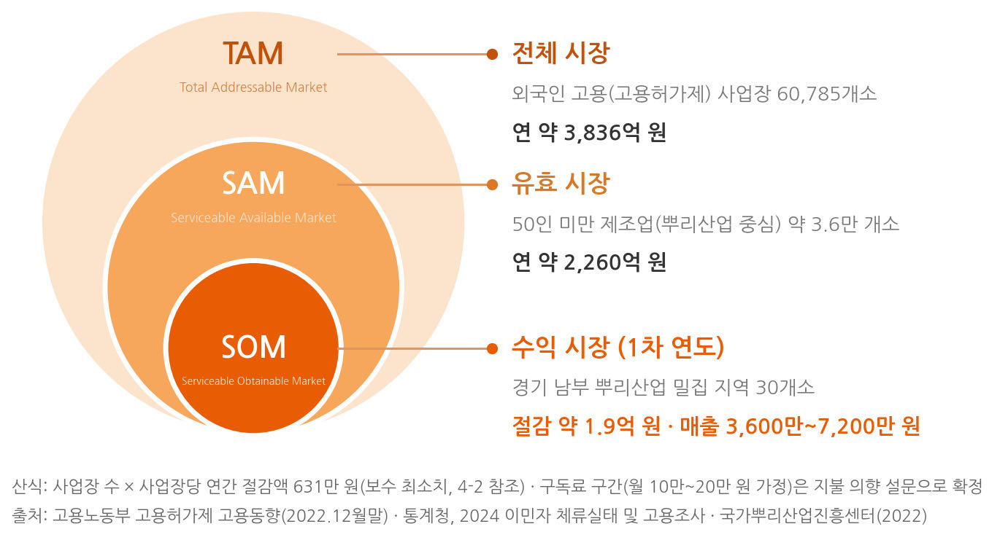
*첨부 11. 시장 규모 분석(TAM-SAM-SOM) — TAM 60,785개소·연 약 3,836억 원 / SAM 약 3.6만 개소·연 약 2,260억 원 / SOM(1차 연도) 경기 남부 뿌리산업 30개소·절감 약 1.9억 원·매출 3,600만~7,200만 원*

### 정성 효과 — 근로자에서 국가까지

| 대상 | 기대효과 |
|---|---|
| 근로자 | 모국어 학습으로 숙련 형성 단축, 오해 기인 사고/불이익 감소, 이해도 데이터의 역량 증명 활용 |
| 사업장 | 소통 비용/수습 기간/산재 리스크 절감, 교육/소통 기록 자동 문서화로 산업안전보건법 증빙 부담 완화 |
| 산업 차원 | 뿌리산업 인력난 완화, 외국 인력 조기 전력화, 용어/지식 데이터의 산업별 자산화 |
| 국가 차원 | 안전한 정착→노동시장 활성화→제조업 기반 강화의 선순환 인프라, 지방 사업장 정착 지원을 통한 지방소멸 완화 기여, 서비스 운용 및 외국인력 정착 지원 등 파생 고용 창출 |

### 활용 방안 — 특정 사례를 넘어 확산 가능한 구조
1차 대상은 뿌리산업 중심의 50인 미만 중소 제조업이며, 용어 사전과 학습 시나리오만 교체하면 건설, 조선, 농축산업으로 수평 확장된다. 공공 연계(B2G)는 정부가 이미 예산을 투입해 운영 중인 채널 위에 얹는다. 외국인근로자 지원센터·지자체 지역정착 사업, 취업교육, 직업훈련 채널에 다국어 교육 콘텐츠와 이해 검증 도구를 공급해, 신규 예산 없이 기존 사업의 전달력을 높이는 방식으로 진입한다.

### 현장 적용과 구현 가능성
학습은 근무 현장이 아니라 출/퇴근, 휴게 시간에 개인 스마트폰으로 이루어지고, 현장에서는 관리자 기기 대면 통역과 설비 QR/NFC 태그로 이미 학습한 내용을 즉시 참조 및 확인한다. 별도 단말이나 앱 설치, 전담 IT 인력 없이 기존 작업지시서와 매뉴얼을 그대로 올리는 것만으로 시작할 수 있어, 50인 미만 사업장도 비교적 쉽게 도입할 수 있다.

---

## 5. 추진 일정

### 1) 개발 일정 — 검증 우선(핵심 파이프라인 선구현)

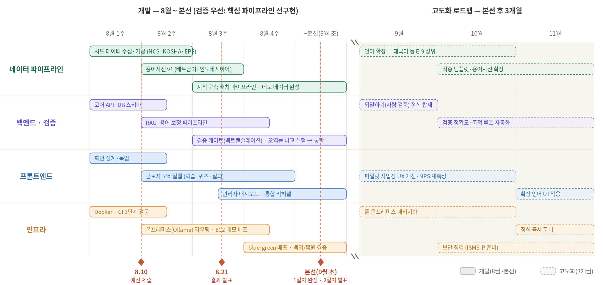
*첨부 12. 개발 일정*

| 기간 | 내용 | 산출물 |
|---|---|---|
| ~8/10 13:00 | 멘토링 피드백 반영 기획 정교화, 현장 인터뷰/설문 수집, 소통 코어(용어 보정 RAG+검증 게이트) 1차 구현·정량 실험 → 예선 기획서 제출 | 기획서 10p, 실험 결과 |
| 8/11~8/21 | API 계약·DB 스키마·네이밍 규칙 확정(Contract-first), 코드 스켈레톤·블루프린트 구축, mock 경계 기반 4인 병렬 개발 착수 | 스켈레톤 저장소, BLUEPRINT 문서 |
| 8/21~본선 전 | 병렬 개발 및 2~3일 주기 통합(mock을 실제 구현으로 순차 교체), 내부 E2E 시나리오 테스트 2회 이상 | 동작 MVP, 이슈 목록 |
| 본선 1일차 | 오프라인 멘토링 반영, 프로토타입 완성·제출, 시연 리허설(로컬 실행·녹화 영상 준비) | 최종 프로토타입 |
| 본선 2일차 | 발표와 시연 — 범위: **소통 코어, 이해 검증, 지식 파이프라인, 선택 모듈 1종** | 발표·시연 |
| 본선 후 +3~6개월 | 파일럿 사업장 1곳 PoC(무상)·피드백 반영 → 언어 3종 확장(태국어 등), 업종 1종(건설) 수평 확장, B2G 연계 협의 | PoC 리포트, 확장 로드맵 |

### 2) 팀 구성과 역할

| 성명 | 역할 | 담당 산출물 |
|---|---|---|
| 김명선 (팀장) | 총괄·데이터 파이프라인 | 지식 구축 파이프라인, 모듈 오케스트레이션, 에이전틱 플로우 설계·구현 |
| 송병갑 | 인프라 | 웹 배포·CI/CD, blue-green 무중단 운영, 온프레미스 격리 보안 아키텍처 |
| 이새봄 | 백엔드 | 에이전트 로직, 이중 검증 하네스(백트랜슬레이션 게이트), API 설계·구현 |
| 한정현 | 프론트엔드 | UI/UX 디자인, 근로자·관리자 웹, 시연 데모 구현 |
